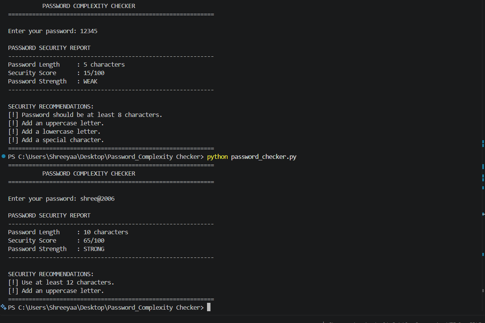

# Password Complexity Checker

## Project Overview

A Python-based Password Complexity Checker that evaluates the strength of a password based on security criteria such as length, uppercase letters, lowercase letters, numbers, and special characters.

## Features

- Checks password length
- Checks uppercase and lowercase letters
- Checks numbers
- Checks special characters
- Displays password strength
- Provides a simple and easy-to-use interface

## Technologies Used

- Python

## Output

